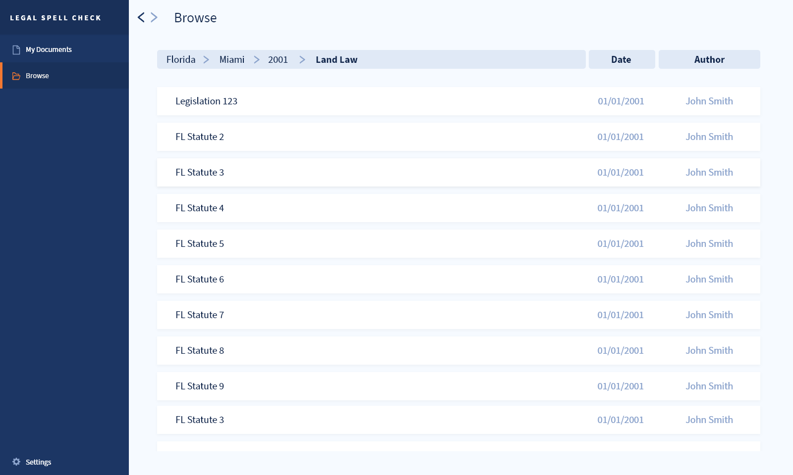
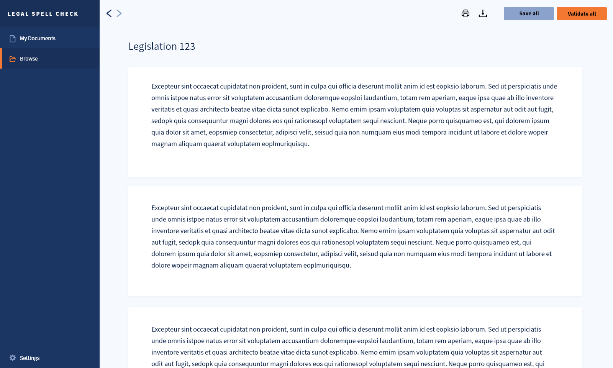
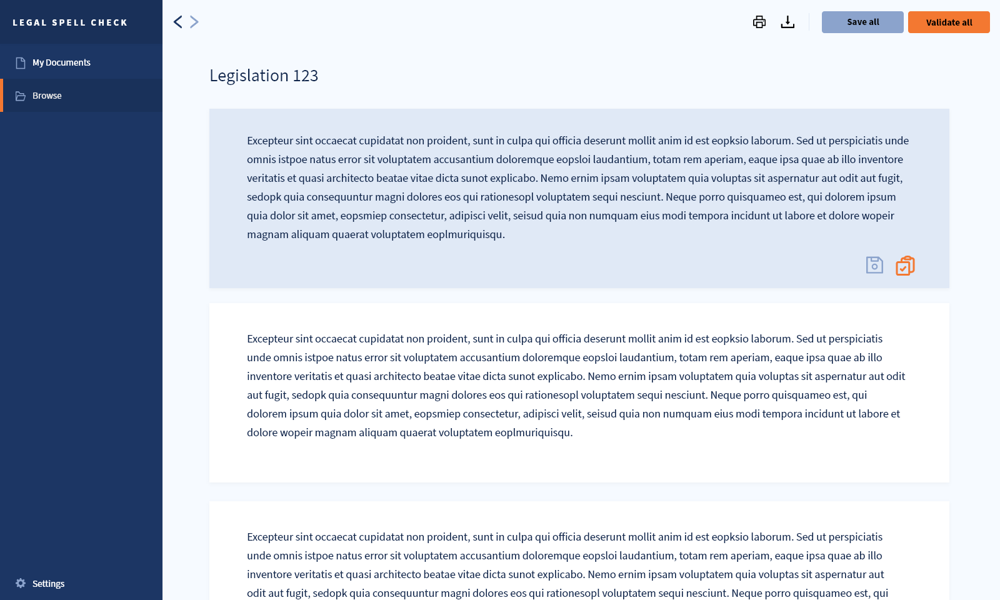
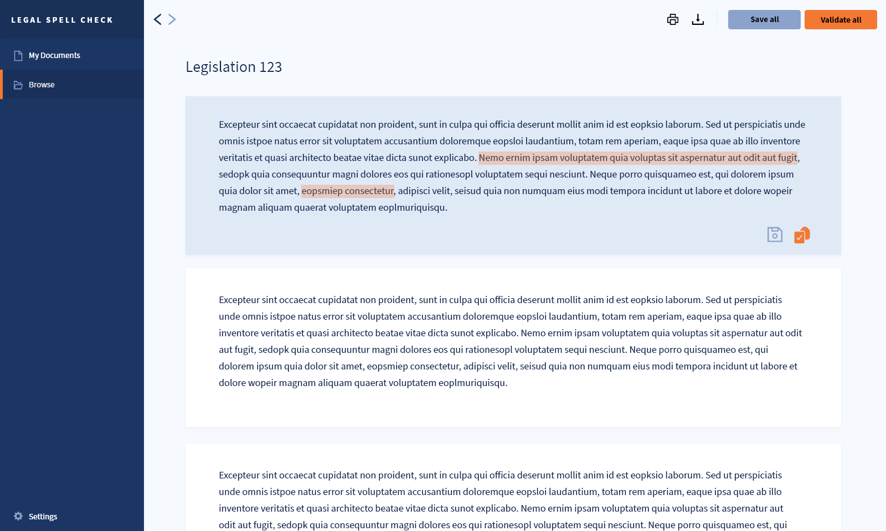
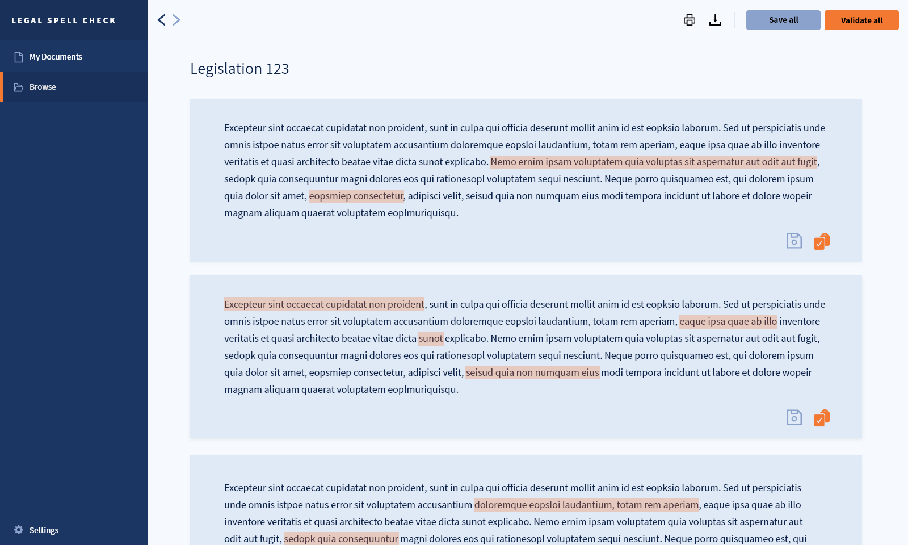
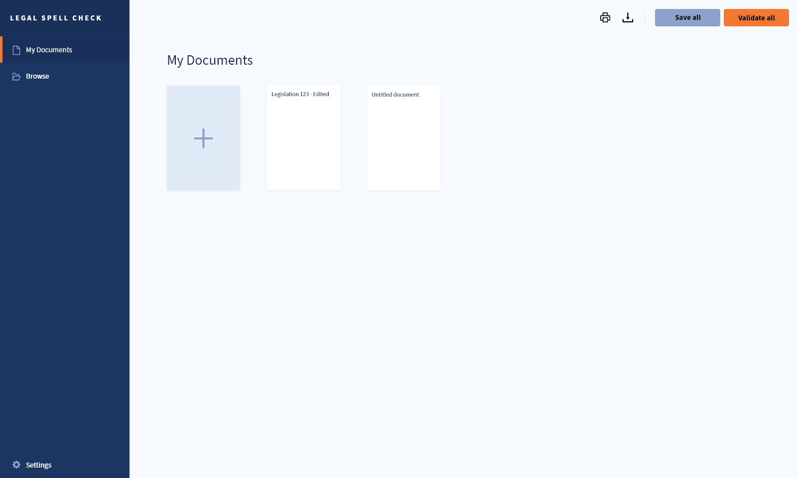
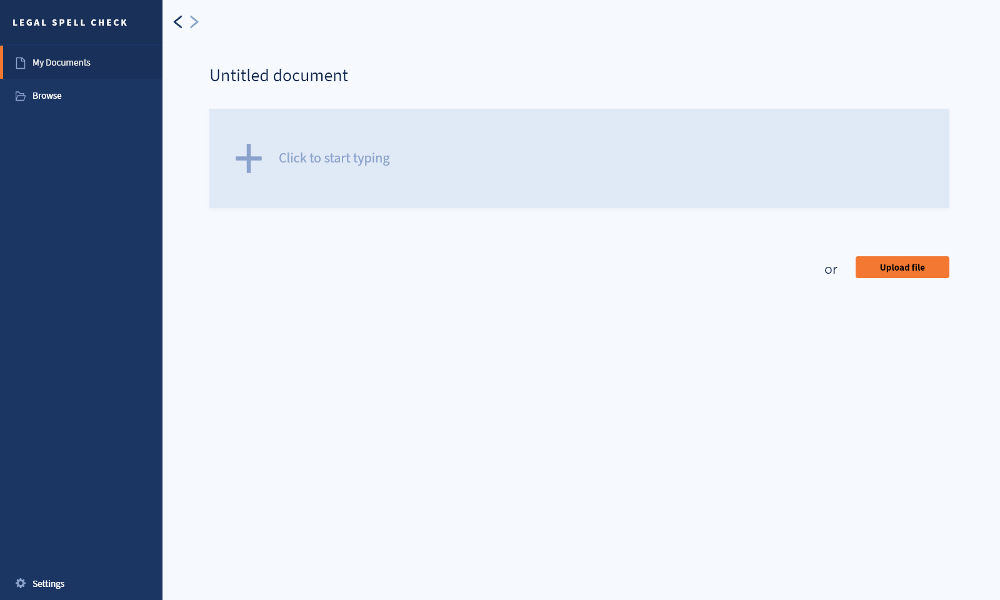
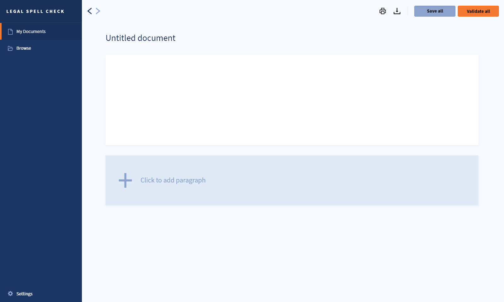

# Prototype
Following the [outline of design](../design_outline.md) the frontend team created a mockup prototype using Adobe Xd to simulate some main user interactions as well as semi-definitive layout and design features.

Images can be viewed in full resolution in the [src](src) folder.

## Layout
The following demo highlights the main *layout components* as shown in the [outline](../design_outline.md). If you are on GitHub web, navigate to the [src](src) folder where you may download the video.

<video controls><source src="src/demo-sections.mp4" type="video/mp4"> </video>

## UI workflows

This will be shown through the following workflows:
* [Flow 1 : **Edit existing document** tab](#flow-1--edit-existing-document)
* [Flow 2 : **Create new document** tab](#flow-2--create-new-document)

### Flow 1 : Edit existing document

**Step I** : The user may edit or view an existing file by browsing in the Browse tab in the *Navigation Panel*.

**Step II** : The user by clicking on the relevant file in the Database opens the *Document editor*.

**Step III** : The user may edit or further interact (save/validate) a single paragraph by pressing on the paragraph window.

**Step IV** : The user may run *spellcheck functions* on a single paragraph by pressing on the validate button. Similarly, the user may *save* the paragraph with or without prior spellcheck validation.

**Step V** : By pressing the Validate button in the *Header* (top-right corner) the user may run spellcheck functions *on all* the paragraphs in the document or save the document.

### Flow 2 : Create new document

**Step I** : The *My Documents* sections allows the user to browse recent/saved/edited files. The user may click on the *plus* icon to *create* or *upload* a new document.

**Step II** : The document creation page allows the user to either start typing by creating a paragraph or pressing the button *Upload* to edit a local file.

**Step III** : Having clicked on the paragraph the app opens the *Document editor* with all its functionalities.
