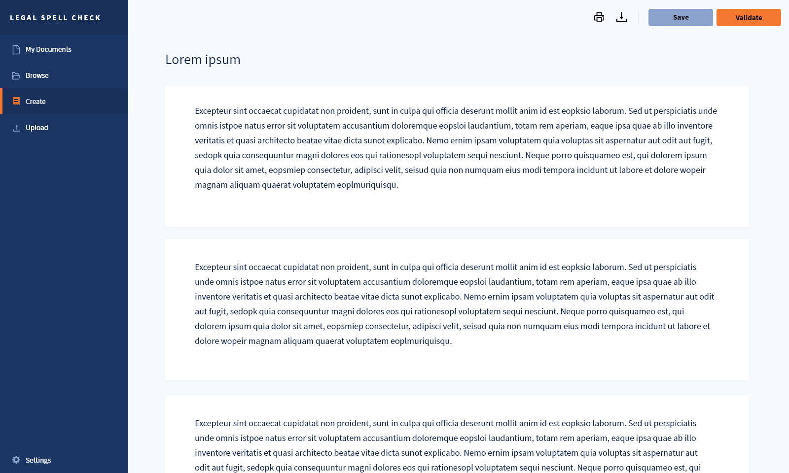
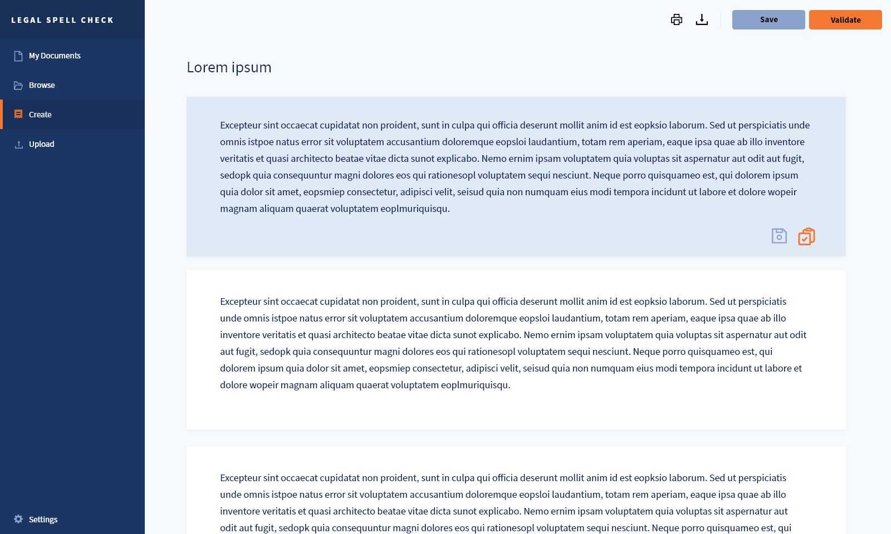
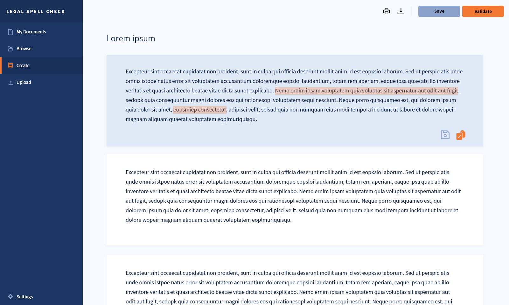
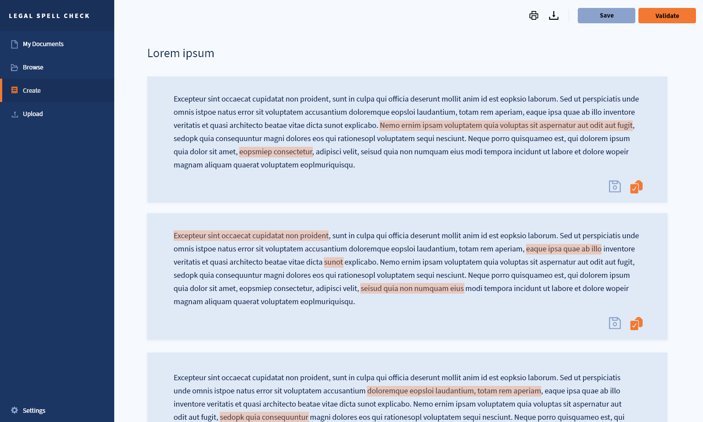
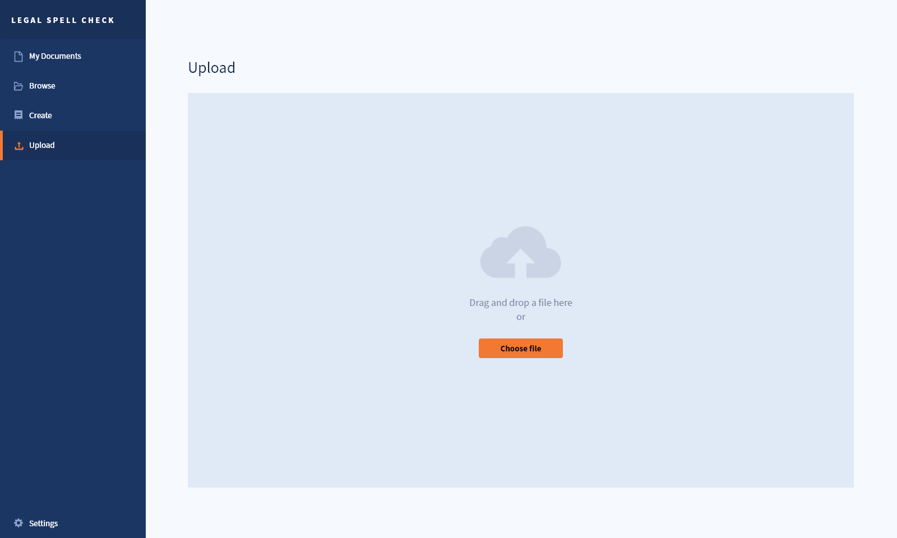

# Prototype
Following the [outline of design](../design_outline.md) the frontend team created a mockup prototype using Adobe Xd to simulate some main user interactions as well as semi-definitive layout and design features.

Images can be viewed in full resolution in the [src](src) folder.

## Layout
The following demo highlights the main *layout components* as shown in the [outline](../design_outline.md).
<video controls><source src="src/demo_layout.mp4" type="video/mp4"> </video>

## UI workflows

This will be shown through the following workflows:
* [Flow 1 : **Create** tab](#flow-1--create)
* [Flow 2 : **Upload** tab](#flow-2--upload)

### Flow 1 : Create

**Step I** : The user may create and edit a document by clicking on the Create tab in the *Navigation Panel*.

**Step II** : The user may edit or further interact (save/validate) a single paragraph by pressing on the window.

**Step III** : The user may run *spellcheck functions* on a single paragraph by pressing on the validate button. Similarly, the user may *save* the paragraph with or without prior spellcheck validation.

**Step IV** : By pressing the Validate button in the *Header* (top-right corner) the user may run spellcheck functions *on all* the paragraphs in the document or save the document.

### Flow 2 : Upload

**Step I** : The user may upload a file on their local machine by clicking on the Upload tab in the *Navigation Panel*.
